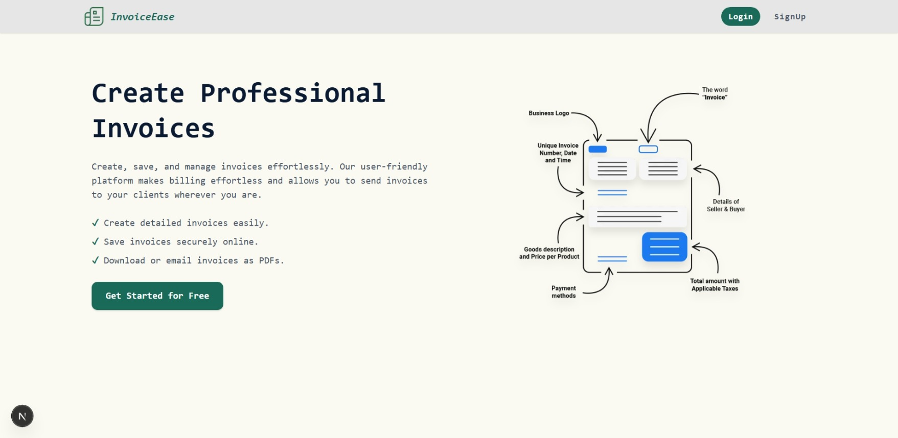
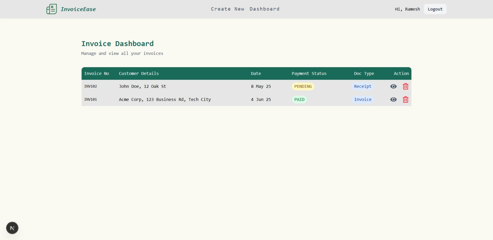
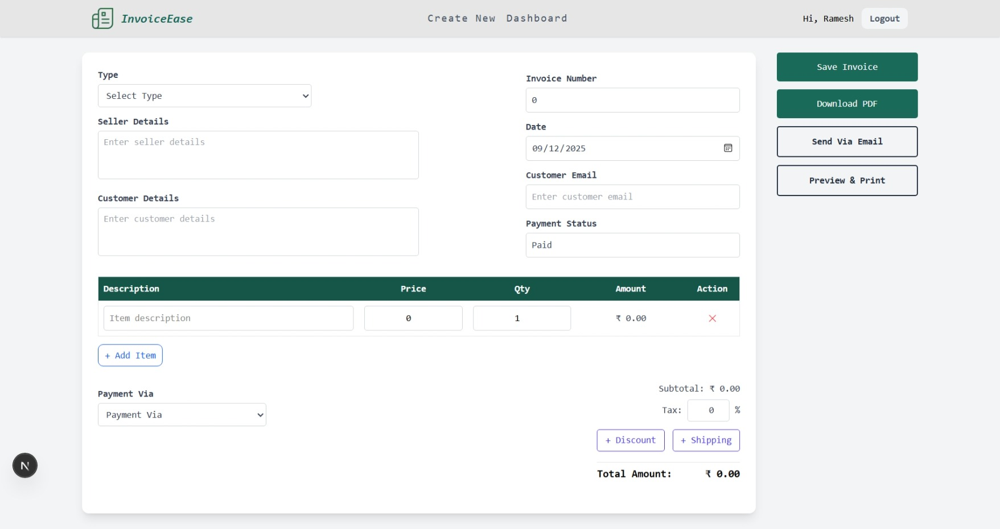
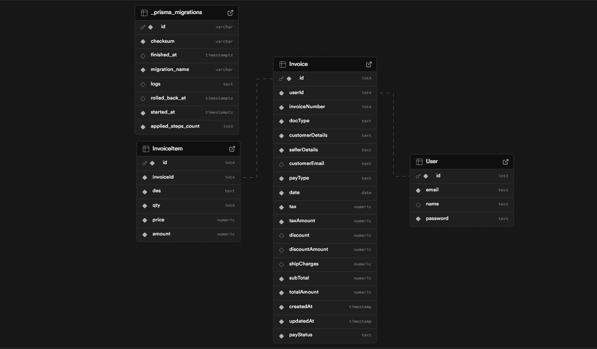
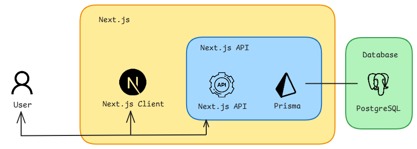

# InvoiceEase
InvoiceEase is a Next.js based invoice management and generator app featuring authentication, a modern dashboard, and seamless PDF export.

## Features
- Authentication with NextAuth and Prisma adapter
- Create, edit, and delete invoices via dashboard
- PDF generation using `@react-pdf/renderer`
- Indian currency formatting (en-IN) with ₹ symbol
- Responsive UI with Tailwind

## Screenshots
|                   Home                |                  Dashboard                     |                   Create Invoice                 |
| :-----------------------------------: | :--------------------------------------------: | :----------------------------------------------: |
|   |  |  |

## Tech Stack
- Next.js 15
- ReactJS
- Tailwind CSS 
- NextAuth 
- Axios, React Hook Form, Zod, React Hot Toast

## Database
- Prisma 7 + PostgreSQL - A modern type-safe ORM (Prisma 7) that provides a clean, auto-generated database client for building applications backed by a PostgreSQL database.
- Migrations are tracked in `prisma/migrations`. 

## Database Schema

## Authentication
- A NextAuth setup using the Credentials provider and Prisma adapter to authenticate users, backed by a Prisma-managed database.
<!-- - Auto logout redirects to `/` (home) -->

## PDF Generation
- Uses `@react-pdf/renderer` to create PDF documents using React components and render them on the server or in the browser.

## System Arch

## Future Enhancements
- Role-based access, multi-tenant support.
- Advanced filtering/sorting/pagination on dashboard.
- Multiple invoice templates and branding assets.
- Emailing invoices with attachments.
- Export/import data (CSV/Excel).
